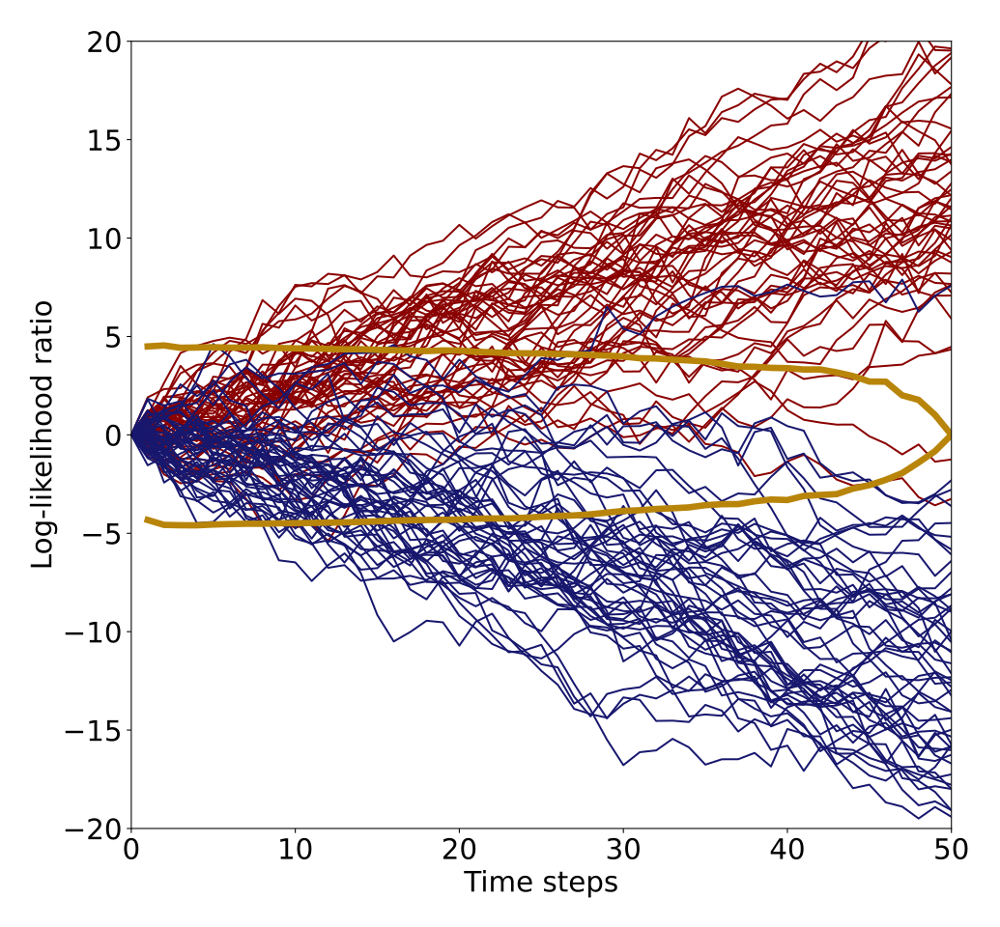

# FIRMBOUND
This repository contains the official PyTorch implementation of **FIRMBOUND**. Based on the Sequential Probability Ratio Test (SPRT), **FIRMBOUND** aims to optimize its decision time given a target error rate (i.e., optimal for early-classification of sequential data). However, unlike the original SPRT, **FIRMBOUND** optimizes the decision within *Finite Horizon*, or classification deadline by providing a time-dependent, dynamic decision threshoulds. 

<div align="center">
<figure>
  
</figure>
</div>
<p align="center">Figure 1: The original SPRT's static decision threshould (brown) and FIRMBOUND's dynamic threshold (orange).</p>

## Quickstart Guide

Follow these steps to utilize the example code provided with our paper:

### Step 1: Run `generate_sequential_gaussian_as_lmdb.ipynb` to Generate Sequential Gaussian Dataset
- Update the header section to generate train, validation, and test LMDB datasets (run three times with parameters of your choice).


### Step 2: Run `density_ratio_estimation_main.py` for Learning to Estimate Log-Likelihood Ratios
- With the **SPRT-TANDEM** framework [1], we provide a statistically consistent estimator of log-density ratio. For the training details, please see [SPRT-TANDEM-PyTorch](https://github.com/Akinori-F-Ebihara/SPRT-TANDEM-PyTorch). For an intuitive understanding, please refer to the [SPRT-TANDEM tutorial](https://github.com/Akinori-F-Ebihara/SPRT-TANDEM_tutorial). 
   - Update `./config/config_dre.py` to include paths to the LMDB datasets before running the density ratio estimation.

### Step 3: Train the Model by running `backward_induction_CFL_train.py` or `backward_induction_GP_train.py`.
- With a Convex Function Learning (CFL) algorithm [2], we provide a statistically consistent estimation of the *backward induction* equation, thereby providing an optimal decision thresholds.
- We also provide a lightweight alternative using Gaussian Process (GP) regression, significantly reducing training overheads. 
  - Set the folder path for saving results in `savedir`.
  - Specify the subproject name created in Step 2 at `subproject`.
  - Set the sampling cost value in `cost_pool`.

### Step 4: Test the Model
- Test on the generated dataset by running `backward_induction_GP_test.py` or `backward_induction_CFL_test.py`.

## Tested Environment
```
python      3.8.10
torch       2.0.0
notebook    6.5.3
optuna      3.1.0
```

## Example results
<div align="center">
<figure>
  
</figure>
</div>
<p align="center">Figure 2: Example result on the two-class Gaussian dataset. The estimatad optimal decision threshold is depcted with the orange curve. The red and blue trajectories denotes the two classes. Correct decision is made when the red and blue curves hit the positive or negative side of the decision threshold, respectively.</p>


<div align="center">
<figure>
  
</figure>
</div>
<p align="center">Figure 3: Example result on the three-class Gaussian dataset. The estimatad optimal decision threshold is depcted with the yellow emvelope. The locations where the three class trajectories (red, blue, and yellow) hit the threshold are highlighted with black crosses.</p>

## Citation
*Please cite the original paper if you use the whole or a part of our code.*
```
@inproceedings{FIRMBOUND,
  title={Learning the Optimal Stopping for\\Early Classification within Finite Horizons\\via Sequential Probability Ratio Test},
  author={Akinori F Ebihara and Taiki Miyagawa and Kazuyuki Sakurai and Hitoshi Imaoka},
  booktitle={International Conference on Learning Representations},
  year={2025},
}
```

## References
1. A. F. Ebihara, T. Miyagawa, K. Sakurai, and H. Imaoka. Sequential density ratio estimation for
simultaneous optimization of speed and accuracy. In The International Conference on Learning
Representations (ICLR), 2021.
2. A. Siahkamari, D. A. E. Acar, C. Liao, K. L. Geyer, V. Saligrama, and B. Kulis. Faster algorithms
for learning convex functions. In K. Chaudhuri, S. Jegelka, L. Song, C. Szepesvari, G. Niu, and
S. Sabato (eds.), Proceedings of the 39th International Conference on Machine Learning (ICML), 2022.